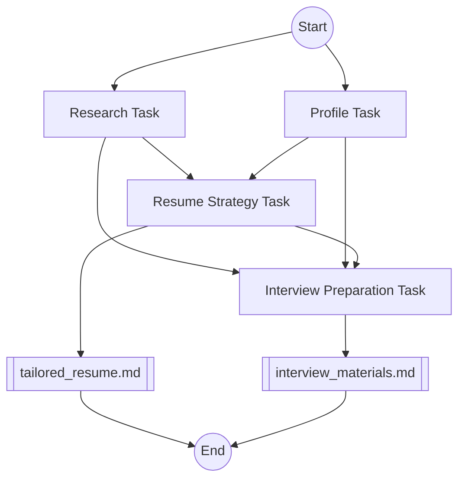

# ResumeCrew

ResumeCrew is an AI-powered tool that helps job seekers tailor their resumes and prepare for interviews using CrewAI.

## Features

- Job posting analysis
- Candidate profiling
- Resume tailoring
- Interview preparation

## How it works

1. **Research**: Analyzes the job posting to extract key requirements.
2. **Profiling**: Creates a comprehensive candidate profile using GitHub and personal information.
3. **Resume Strategy**: Tailors the resume to highlight relevant skills and experiences.
4. **Interview Preparation**: Generates potential interview questions and talking points.

## Diagram

