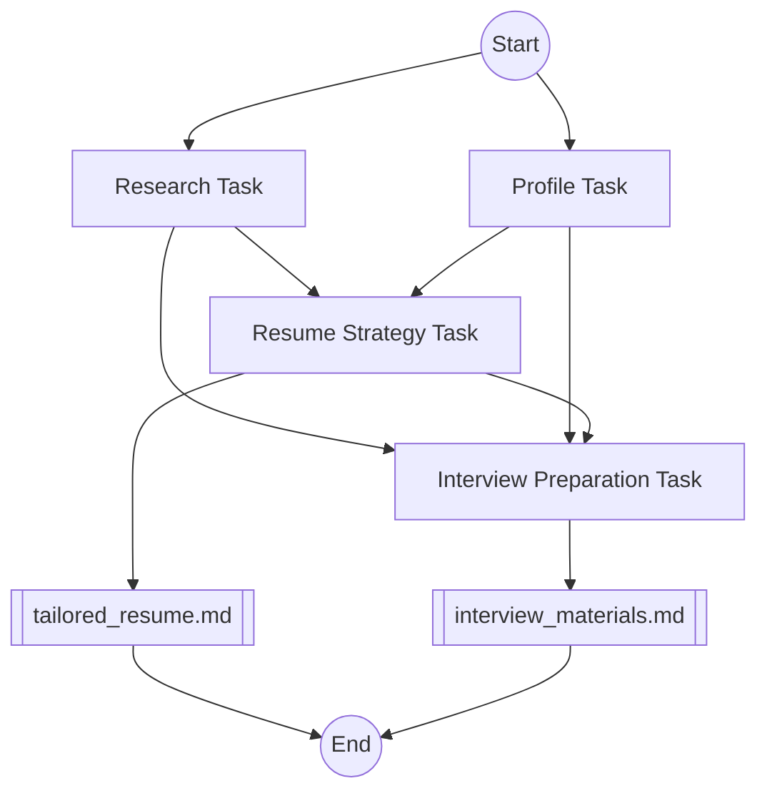

# 🚀 ResumeCrew

ResumeCrew is an AI-powered tool that helps job seekers tailor their resumes and prepare for interviews using CrewAI.

## 📋 Table of Contents
- [Features](#-features)
- [How it works](#-how-it-works)
- [Installation](#-installation)
- [Usage](#-usage)
- [Diagram](#-diagram)
- [Contributing](#-contributing)
- [License](#-license)
- [Thanks](#-thanks)

## ✨ Features

- 🔍 **Job posting analysis**: Analyzes job postings to extract key requirements.
- 👤 **Candidate profiling**: Creates a comprehensive candidate profile using GitHub and personal information.
- 📝 **Resume tailoring**: Tailors the resume to highlight relevant skills and experiences.
- 🎤 **Interview preparation**: Generates potential interview questions and talking points.

## 🛠️ How it works

1. **🔍 Research**: Analyzes the job posting to extract key requirements.
2. **👤 Profiling**: Creates a comprehensive candidate profile using GitHub and personal information.
3. **📝 Resume Strategy**: Tailors the resume to highlight relevant skills and experiences.
4. **🎤 Interview Preparation**: Generates potential interview questions and talking points.

## 🛠️ Installation

1. Clone the repository:

```sh
git clone https://github.com/alexnodeland/resume-crew.git
```

2. Install the dependencies:

```sh
poetry install
```

3. Copy the `.env.example` file to `.env` and fill in the required environment variables.

## 🚀 Usage

1. Run the application:

```sh
poetry run resume_crew
```

2. Follow the CLI prompts to use the application.

## 📊 Diagram



## 🤝 Contributing

Contributions are welcome! Please read the [contributing guidelines](CONTRIBUTING.md) first.

## 🙏 Thanks

This project was adapted from an example in the course [Multi AI Agent Systems with crewAI](https://www.deeplearning.ai/short-courses/multi-ai-agent-systems-with-crewai/). I would like to extend our gratitude to the course creators João Moura, CrewAI, and Deeplearning.AI for providing such a comprehensive and insightful resource.
