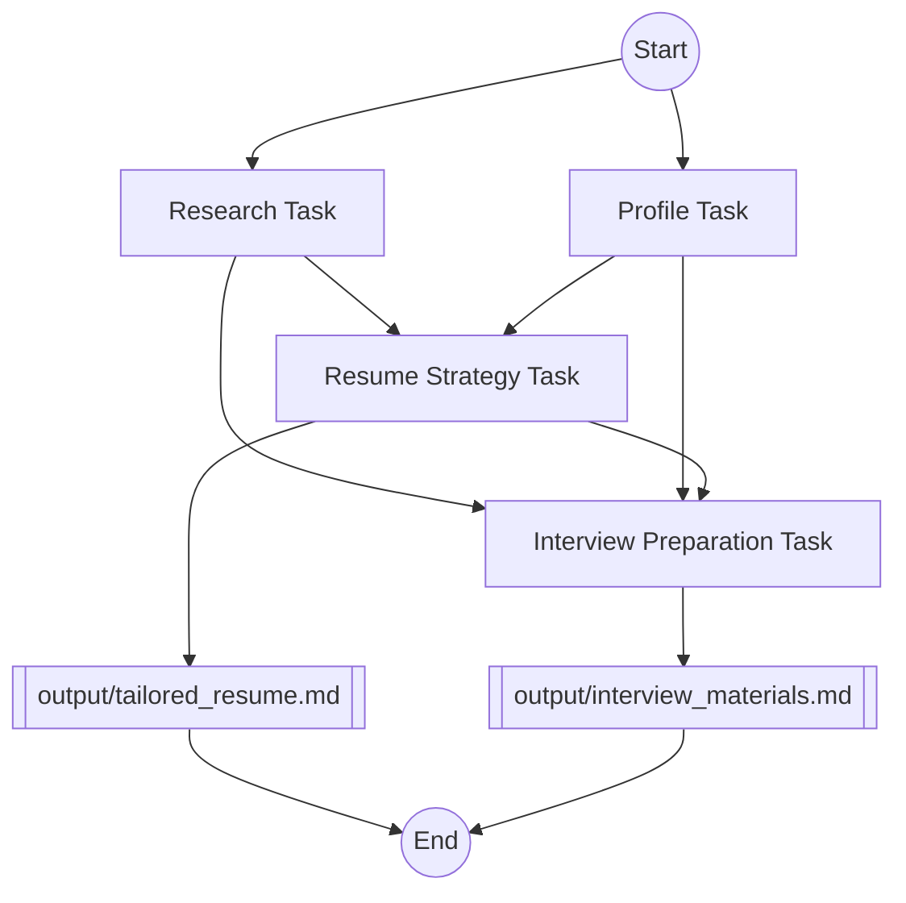

```
    ____                                 ______                 
   / __ \___  _______  ______ ___  ___  / ____/_______ _      __
  / /_/ / _ \/ ___/ / / / __ `__ \/ _ \/ /   / ___/ _ \ | /| / /
 / _, _/  __(__  ) /_/ / / / / / /  __/ /___/ /  /  __/ |/ |/ / 
/_/ |_|\___/____/\__,_/_/ /_/ /_/\___/\____/_/   \___/|__/|__/  

Your companion for customizing resumes and preparing for interviews.
```

# 🚀 ResumeCrew

ResumeCrew is an AI-powered tool that helps job seekers tailor their resumes and prepare for interviews using [CrewAI](https://github.com/joaomdmoura/crewAI).

## 📋 Table of Contents
- [Workflow](#-workflow)
- [Diagram](#-diagram)
- [Installation](#-installation)
- [Usage](#-usage)
- [Contributing](#-contributing)
- [License](#-license)
- [Thanks](#-thanks)

## ✨ Workflow

ResumeCrew streamlines your job application process through four key steps:

1. 🔍 **Job Posting Analysis**: Extracts key requirements from the job posting.
2. 👤 **Candidate Profiling**: Creates a comprehensive profile using your GitHub and personal information.
3. 📝 **Resume Tailoring**: Customizes your resume to highlight relevant skills and experiences.
4. 🎤 **Interview Preparation**: Generates potential questions and talking points for your interview.

Each step is powered by AI to provide you with tailored, insightful results for your job application.

## 📊 Diagram



## 🛠️ Installation

1. Clone the repository:

```sh
git clone https://github.com/alexnodeland/resume-crew.git
```

2. Install the dependencies:

```sh
poetry install
```

## 🚀 Usage

1. Copy the `.env.example` file to `.env` and fill in the required environment variables.

2. (Optional) Modify the `cli-default.json` file to customize defaults to your specific data, including:

    - `applicant_name`: Your full name.
    - `job_posting_url`: The URL of the job posting you are applying to.
    - `github_url`: The URL of your GitHub profile.
    - `personal_writeup`: A brief writeup about your professional background and skills.

3. Pleace your resume in the `data` directory, and name it `resume.md`.
    
4. Run the application:

```sh
poetry run resume-crew
```

5. Follow the CLI prompts to use the application, or press `Enter` to use the default values, set in `cli-default.json`.

## 🤝 Contributing

Contributions are welcome! Please read the [contributing guidelines](CONTRIBUTING.md) first.

## 🙏 Thanks

This project was adapted from an example in the course [Multi AI Agent Systems with crewAI](https://www.deeplearning.ai/short-courses/multi-ai-agent-systems-with-crewai/). I would like to extend our gratitude to the course creators [João Moura](https://github.com/joaomdmoura), [CrewAI](https://www.crewai.com/), and [Deeplearning.AI](https://www.deeplearning.ai/) for providing such a comprehensive and insightful resource.
